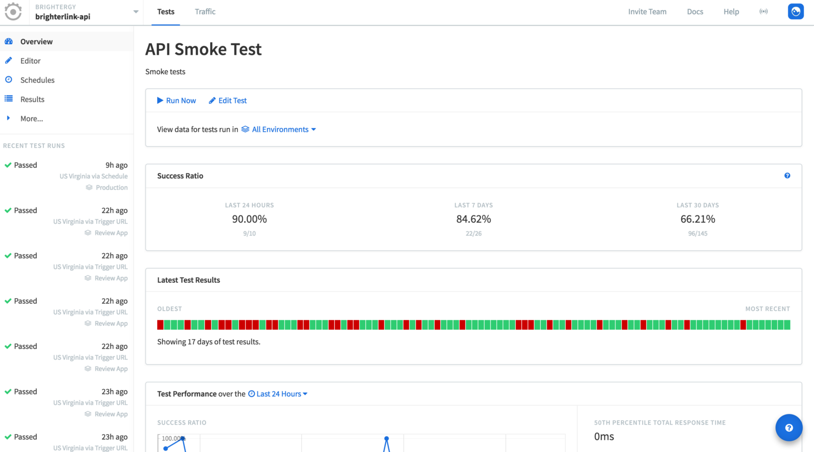
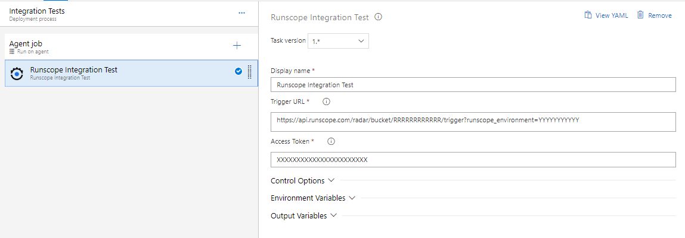

## Runscope Integration Test

Allows you to run runscope tests in azure pipelines and wait for success ou failed result.

## Usage
Add a new task, select **Runscope Integration Test** from the **Test** category and configure it as needed.

Parameters include:
- **Trigger URL**: Trigger URL from Bucket or individual test case. This URL starts a new test execution. [Click here to read more](https://www.runscope.com/docs/api-testing/integrations/)
- **API Key**: API Key to authenticate in Runscope API and make pulling to wait results. [Click here to read more](https://www.runscope.com/docs/api-testing/circleci/#api-key)

## Release notes

**New in 1.1.2**
- First version with basic integration test flow;
- Execute bucket or single test case;
- Wait results to continue tasks (success) or abort (fails);

## Did you like it? Please, make a donate :)

if you liked this project, please make a contribution and help to keep this and other initiatives, send me some Satochis.

BTC Wallet: `1G535x1rYdMo9CNdTGK3eG6XJddBHdaqfX`

